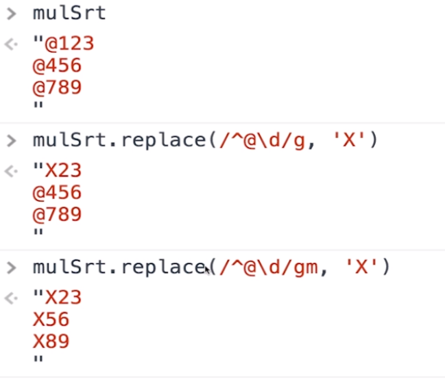

##### 正则表达式

- 定义：使用单个字符串来描述、匹配一系列符合某个句法规则的字符串。说简单了就是按照某种规则去匹配符合条件的字符串。

- [正则表达式图形工具](https://regexper.com/)

- 分为两种

  ```js
  // 1. 字面量
  var reg = /\bis\b/g;
  'he is a boy,This is a dog.Where is she?'.replace(reg,'IS');//"he IS a boy,This IS a dog.Where IS she?"
  // 2. 构造函数
  var reg = new RegExp('\\bis\\b','g');
  'he is a boy,This is a dog.Where is she?'.replace(reg,'IS');// "he IS a boy,This IS a dog.Where IS she?"
  ```

##### 修饰符

- `g` 全文搜索，不添加，搜索到第一个匹配停止。默认false。

- `i` 忽略大小写，默认大小写敏感。默认false。

  ```js
  'he is a boy,This is a dog.Where Is she?'.replace(/\bis\b/g,'0'); // "he 0 a boy,This 0 a dog.Where Is she?"
  'he is a boy,This is a dog.Where Is she?'.replace(/\bis\b/gi,'0');//"he 0 a boy,This 0 a dog.Where 0 she?"
  ```

- `m` 多行匹配，默认false。

  

##### 元字符

- 正则表达式由两种基本字符类型组成：

  - 原义文本字符

  - 元字符（在正则表达式中有特殊含义的非字母字符）

    | 字符 | 含义              |
    | ---- | ----------------- |
    | \t   | 水平制表符        |
    | \v   | 垂直制表符        |
    | \n   | 换行符            |
    | \r   | 回车符            |
    | \0   | 空字符            |
    | \f   | 换页符            |
    | \cX  | 与X对应的控制字符 |

##### 字符类

- 可以使用元字符[]来构建一个简单的类

- 所谓类是指符合某些特性的对象，一个泛指，而不是特指某个字符

- 表达式[abc]把字符a或b或c归为一类，表达式可以匹配这类的字符

  ```js
  'a1b2c3d5'.replace(/[abc]/g,'X'); // "X1X2X3d5"
  ```

##### 字符类取反

- 使用元字符 `^` 创建反向类/负向类

- 反向类的意思是不属于某类的内容

- 表达式 `[^abc]` 表示不是字符a或b或c的内容

  ```js
  'a1b2c3d5'.replace(/[^abc]/g,'X'); // "aXbXcXXX"
  ```

##### 范围类

- 可以使用[a-z]来连接两个字符表示从a到z的任意字符

- 这是一个闭区间，也就是包含a和z本身

  ```js
  'a1b2d3x5z9w122'.replace(/[a-z]/g,'A'); // "A1A2A3A5A9A122"
  ```

- 在[]组成的类内部是可以连写的  `[a-zA-Z]`

  ```js
  'A1b2dDQx5z9w1BB2Z'.replace(/[a-zA-Z]/g,'我'); // "我1我2我我我我5我9我1我我2我"
  '2019-09-02'.replace(/[0-9-]/g,'懿'); // "懿懿懿懿懿懿懿懿懿懿"
  ```

##### 预定义类

- 预定义类指的是某些常见模式的简写方式

  | 字符 | 等价类          | 含义                             |
  | ---- | --------------- | -------------------------------- |
  | .    | [^\r\n]         | 除了回车符和换行符之外的所有字符 |
  | \d   | [0-9]           | 数字字符                         |
  | \D   | [^0-9]          | 非数字字符                       |
  | \s   | [\t\n\x0B\f\r]  | 空白符                           |
  | \S   | [^\t\n\x0B\f\r] | 非空白符                         |
  | \w   | [a-zA-Z_0-9]    | 单词字符（字母、数字、下划线）   |
  | \W   | [&a-zA-Z_0-9]   | 非单词字符                       |

##### 边界

- 正则表达式还提供了几个常用的边界匹配字符

  | 字符 | 含义       |
  | ---- | ---------- |
  | ^    | 以xxx开始  |
  | $    | 以xxx结束  |
  | \b   | 单词边界   |
  | \B   | 非单词边界 |

  ```js
  '@123@abc@'.replace(/@./g,'Q'); // "Q23Qbc@"
  '@123@abc@'.replace(/^@./g,'Q');// "Q23@abc@"
  '@123@abc@'.replace(/.@$/g,'Q');// "@123@abQ"
  
  'this is a boy'.replace(/is/g,'IS'); //"thIS IS a boy"
  'this is a boy'.replace(/\bis\b/g,'IS'); // "this IS a boy"
  'this is a boy'.replace(/\Bis\b/g,'IS'); // "thIS is a boy"
  ```

##### 量词

| 字符  | 含义                           |
| ----- | ------------------------------ |
| ?     | 出现零次或一次（最多出现一次） |
| +     | 出现一次或多次（至少出现一次） |
| *     | 出现零次或多次（任意次）       |
| {n}   | 出现n次                        |
| {n,m} | 出现n到m次                     |
| {n,}  | 至少出现n次                    |

##### 贪婪与非贪婪模式

- 贪婪模式(默认)

  ```js
  '12345678'.replace(/\d{3,6}/g,'X'); // "X78"
  ```

- 非贪婪模式

  - 让正则表达式尽可能少的匹配，也就是说一旦成功匹配不再继续尝试就是非贪婪模式
  - 做法很简单，在量词后加上 ? 就可以了

  ```js
  '12345678'.replace(/\d{3,6}?/g,'X'); // "XX78"
  '123456789'.match(/\d{3,5}?/g); // ["123", "456", "789"]
  ```

##### 分组

- 使用 `()` 可以达到分组的功能，使量词作用于分组

  ```js
  'a1b2c3d4e5f'.replace(/([a-z]\d){3}/g,'我'); // "我d4e5f"
  ```

- 或
  - 使用 `|` 可以达到或的效果

  ```js
  'ByronCasper'.replace(/Byron|Casper/g,'我'); // '我我'
  'ByronsperByrCasper'.replace(/Byr(on|Ca)sper/g,'我'); // '我我'
  ```

- 反向引用

  ```js
  '2020-05-22'.replace(/(\d{4})-(\d{2})-(\d{2})/g,'$2-$3-$1');// "05-22-2020"
  ```

- 忽略分组
  - 不希望捕获某些分组，只需要在分组内加上 `?:` 就可以

##### 前瞻

- 正则表达式从文本头部向尾部开始解析，文本尾部方向，称为“前”
- 前瞻就是在正则表达式匹配到规则的时候，向前检查是否符合断言，后顾/后瞻方向相反
- JavaScript不支持后顾
- 符合和不符合特定断言称为肯定/正向匹配和否定/负向匹配

| 名称     | 正则           | 含义     |
| -------- | -------------- | -------- |
| 正向前瞻 | exp(?=assert)  |          |
| 负向前瞻 | exp(?!assert)  |          |
| 正向后顾 | exp(?<=assert) | js不支持 |
| 负向后顾 | exp(?<!assert) | js不支持 |

```js
'a2*3'.replace(/\w(?=\d)/g,'Q'); // "Q2*3"
'a2*34v8A12'.replace(/\w(?=\d)/g,'Q'); // "Q2*Q4Q8QQ2"
'a2*34v8A12'.replace(/\w(?!\d)/g,'Q'); // "aQ*3QvQA1Q"
```

##### JS对象属性

- lastIndex:是当前表达式匹配内容的最后一个字符的下一个位置
- source: 正则表达式的文本字符串

##### test

- RegExp.prototype.test(str)
- 用于测试字符串参数中是否存在匹配正则表达式模式的字符串
- 如果存在则返回true，否则返回false

##### exec

- RegExp.prototype.exec()
- 使用正则表达式模式对字符串执行搜索，并将更新全局RegExp对象的属性以反映匹配结果
- 如果没有匹配的文本则返回null，否则返回一个结果数组，这个数组有两个额外的属性
  - index声明匹配文本的第一个字符的位置
  - input存放被检索的字符串string

##### 非全局调用

- 调用非全局的RegExp对象的exec()时，返回数组
- 第一个元素是与正则表达式相匹配的文本
- 第二个元素是与RegExpObject的第一个子表达式相匹配的文本（如果有的话）
- 第三个元素是与RegExp对象的第二个子表达式相匹配都是文本（如果有的话），以此类推

##### 字符串对象方法

- search()方法用于检索字符串中指定的子字符串，或检索与正则表达式相匹配的子字符串
  - 方法返回第一个匹配结果index，查找不到返回-1
  - search()方法不执行全局匹配，它将忽略标志g，并且总是从字符串的开始进行检索
- match()方法将检索字符串，以找到一个或多个与regexp匹配的文本
  - regexp是否具有标志g对结果影响很大
  - 如果regexp没有标志g，那么match()方法就只能在字符串中执行一次匹配
    - 如果没有找到任何匹配的文本，将返回null
    - 否则它将返回一个数组，其中存放了与它找到的匹配文本有关的信息
    - 返回数组 的第一个元素存放的是匹配文本，而其余的元素存放的是与正则表达式的子表达式匹配的文本
    - 除了常规的数组元素之外，返回的数组还含有2个对象属性
      - index声明匹配文本的起始字符串在字符串的位置
      - input声明对stringObject的引用
  - 如果regexp具有标志g则match()方法将执行全局检索，找到字符串中的所有匹配子字符串
    - 没有找到任何匹配的子串，则返回null
    - 如果找到了一个或多个匹配子串，将返回一个数组
    - 数组元素中存放的是字符串中所有的匹配子串，而且也没有index属性或input属性

- split()，经常用它把字符串分割为字符数组

  ```js
  'a,b,c,d'.split(','); // ["a", "b", "c", "d"]
  // 在一些复杂的分割情况下我们可以使用正则表达式解决
  'a1b2c3d'.split(/\d/); // ["a", "b", "c", "d"]
  ```

- replace()